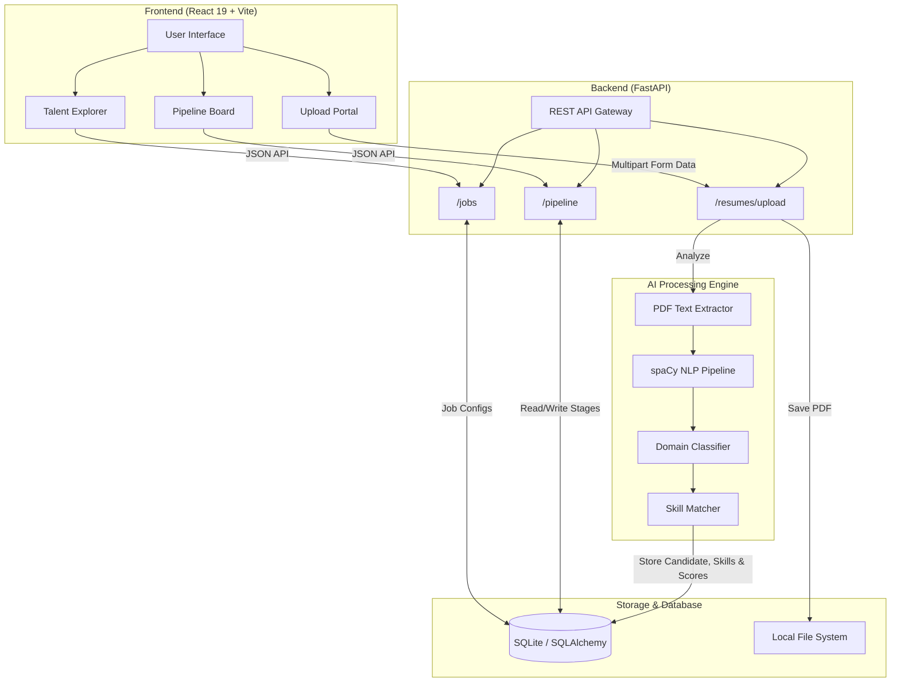

# 🚀 Candiq: AI-Powered Candidate Intelligence & Recruitment Platform

Welcome to **Candiq**, the ultimate, state-of-the-art recruitment and candidate intelligence platform. Candiq doesn't just manage resumes—it actively understands them, evaluates them against live job requirements, and organizes them into an automated Kanban pipeline using advanced AI models and a breathtaking user interface.

---

## 🎨 What Makes Candiq Unique?

Candiq sets itself apart through a complete reimagination of both the **Recruiter Experience (RX)** and **AI Safety**.

1. **Unparalleled Aesthetic & Fluid UI:** Unlike rigid, corporate ATS systems, Candiq features a premium "Plum Peach Butter" aesthetic. The interface is built using bespoke **Liquid Glass Button** interfaces, real-time **WebGL Fluid GPU Backgrounds (DyeWhorl)**, and ultra-smooth framer-motion micro-animations. It feels more like a high-end creative suite than HR software.
2. **Transparent, Explainable AI:** Candiq eliminates black-box bias. Instead of just giving a candidate a generic "Yes/No", it uses a transparent **6-signal hybrid matching engine** (combining deterministic NLP, ML domain prediction, and semantic vector embeddings) to show *exactly* why a candidate matches a job.
3. **Automated Kanban Auto-Pipelines:** When a recruiter uploads a batch of PDF resumes, they can assign them directly to a job pipeline. The system processes the PDFs, extracts the skills, creates the candidate profiles, and instantly drops them into the `Applied` column of a drag-and-drop Kanban board without a single manual data-entry keystroke.
4. **Out-of-Domain (OOD) Protection:** The AI knows what it doesn't know. Resumes that the AI is uncertain about are flagged using an OOD threshold and sent to human review, preventing automated unfair rejections.

---

## 🛠️ Technology Stack & "The Why"

Candiq was purpose-built using the following carefully selected technologies:

### Frontend Layer
*   **React 19 & Vite:** Selected for lightning-fast module replacement during development and modern concurrent rendering optimizations.
*   **Tailwind CSS v4 & Framer Motion:** Tailwind allows for rapid, utility-first styling, while Framer Motion drives the fluid, state-based animations (like expanding sidebars and dragging Kanban cards) that make the UI feel alive.
*   **Zustand:** Chosen over Redux for global state management due to its minimal boilerplate, allowing us to manage complex Kanban states effortlessly.
*   **React Router v7:** Provides seamless, single-page application navigation without full page reloads.

### Backend & API Layer
*   **Python & FastAPI:** FastAPI was the only logical choice for the backend due to its native asynchronous support, making it perfect for handling heavy I/O operations like PDF parsing and ML model inference without blocking the server.
*   **SQLAlchemy & SQLite:** SQLAlchemy provides a robust ORM that protects against SQL injection, while SQLite allows for immediate, zero-config local deployments (with seamless upgrade paths to PostgreSQL).

### AI & Machine Learning Engine
*   **spaCy (NLP):** Used for lightning-fast deterministic phrase matching. It physically understands the lexical structure of the resume text to extract skills.
*   **Scikit-Learn (LinearSVC & TF-IDF):** Chosen for domain classification because it is highly calibrated and explainable, achieving 97.84% accuracy without the unpredictable hallucinations of Generative AI.
*   **SentenceTransformers (all-MiniLM-L6-v2):** Provides 384-dimensional dense vector semantic search, allowing the system to understand that "React" and "Next.js" are related, even if they don't share keywords.

---

## 🏗️ Archify System Architecture Diagram

Below is the automated architecture topology generated for Candiq:



---

## ⚙️ Detailed Feature & Function Breakdown

Every component in Candiq has a specific, automated role to streamline recruitment:

### 1. The Global Upload Portal
*   **Function:** Accepts drag-and-drop uploads of multiple PDF resumes simultaneously.
*   **How it Works:** Sends multipart form data to the backend, validates the PDF integrity (ignoring macros/malware), and invokes the AI pipeline. 
*   **Pipeline Integration:** A dropdown allows recruiters to select an active Job. Once uploaded, the AI parses the resume, generates a candidate, and the frontend automatically makes a secondary API call to inject the new candidate directly into the selected job's Pipeline board.

### 2. The Talent Explorer (Global Pool)
*   **Function:** Acts as the master database for every candidate ever parsed by the system.
*   **How it Works:** Recruiter can search via keywords or semantic vectors. The UI presents detailed candidate cards displaying their ML-predicted domain (e.g., Software Engineering, Data Science), matching confidence scores, and extracted skills.
*   **Pipeline Integration:** Clicking "Add to Pipeline" on a candidate card allows recruiters to manually push existing talent from previous jobs into new, active job pipelines.

### 3. The Interactive Kanban Pipeline
*   **Function:** A visual, drag-and-drop board for tracking candidates through the hiring lifecycle (`Applied` -> `Screened` -> `Shortlisted` -> `Interview` -> `Offer` -> `Hired`).
*   **How it Works:** Tracks the exact timestamp of every stage movement. The UI features beautifully rounded cards that display the candidate's avatar, match score, domain, and time spent in the current stage.
*   **Auditing:** Every drag-and-drop movement is logged in the `PipelineHistory` database table, creating a strict, compliance-ready audit trail of who moved a candidate and when.

### 4. Native Desktop Notifications
*   **Function:** Keeps the recruiter informed without needing to stare at the web app.
*   **How it Works:** By clicking the interactive neon-green Bell icon in the header, the app hooks into the browser's native `Notification API`. It requests secure permission and allows the system to push critical pipeline updates directly to the recruiter's desktop OS.

### 5. Multi-Tenant Security & Authentication
*   **Function:** Secures the platform data.
*   **How it Works:** Implements JWT (JSON Web Tokens) with aggressive token-blocklisting on logout. Includes Role-Based Access Control (RBAC) ensuring that HR admins, standard recruiters, and read-only viewers only see the data they are authorized to access.

---

## 🚀 Getting Started

### Local Deployment
Candiq comes packaged with a completely containerized deployment configuration.

```bash
# 1. Start the backend API server (FastAPI)
cd backend
python -m venv .venv
source .venv/bin/activate
pip install -r requirements.txt
python -m uvicorn app.main:app --reload

# 2. Start the Frontend (Vite)
cd frontend_react
npm install
npm run dev
```

### Documentation
- [Architecture & ML Decisions](docs/TECHNICAL_DECISIONS.md)
- [Development Guide](docs/DEVELOPMENT.md)
